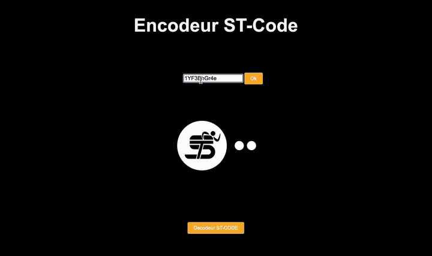
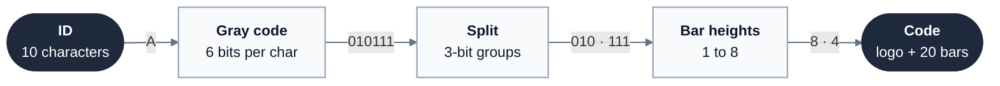
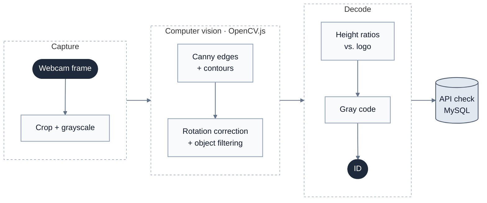

# Spotify Code Rebuilt

**Scannable "sound-wave" codes like Spotify Codes, rebuilt from scratch and decoded from a webcam in the browser using classic computer vision.**

## Why

[Spotify Codes](https://boonepeter.github.io/posts/2020-11-10-spotify-codes/) show that a row of bars of different heights can replace a QR code and look much better. The format is described in Spotify's patents (EP 3444755, US 2018/0181849), but no implementation is published.

- **Barcode format, based on Spotify Codes.** An ID of 10 alphanumeric characters becomes 20 bars with 8 possible heights, drawn next to a logo whose size gives the scanner a reference height. Spotify's own codes also carry 20 bars of data.
- **Scanner that runs entirely in the browser.** OpenCV.js (WebAssembly) finds the bars in the webcam feed and corrects for rotation, using deterministic image processing only. The decoded ID is then checked against a database through a small PHP API.
- **Prototype ports in C++ and Python** of the bar-height extraction step.

## How it works

**Encoding**: the example follows the character `A` through each step.

**Decoding**

As in Spotify's design, the bars use **Gray code**: two neighboring heights differ by only one bit. If a bar is misread as the next height up or down, only one bit of the result is wrong. Spotify also adds a CRC and forward error correction, which are the next step for this project.
